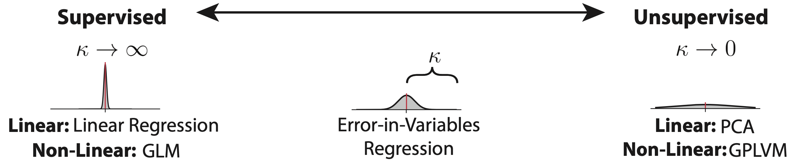
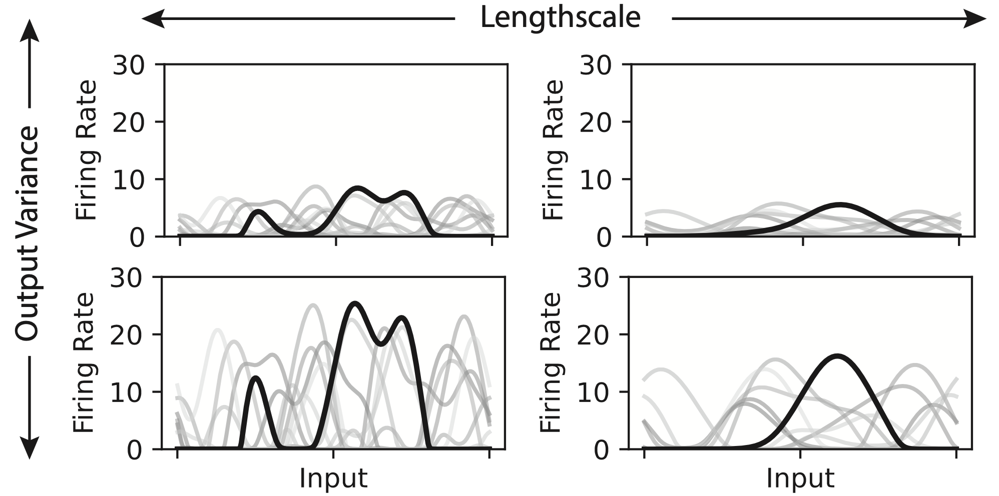
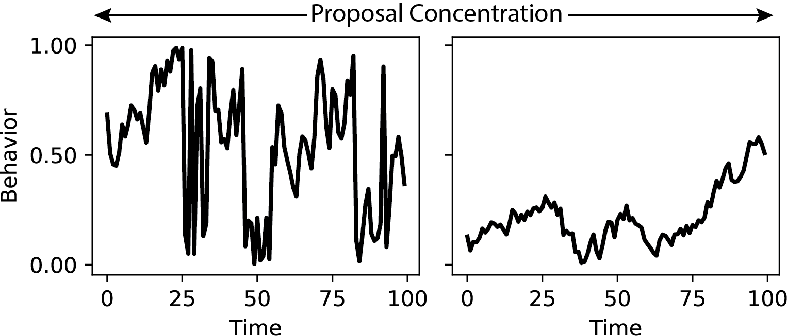

# error-in-variables-garon-2026

> **Tracking the Fidelity of Internal Neural Representations with Error-In-Variables Regression**
> Isabel Garon, Stephen Keeley, Alex H. Williams
> bioRxiv 2026.04.22.720005; doi: [10.64898/2026.04.22.720005](https://doi.org/10.64898/2026.04.22.720005)

JAX implementation of error-in-variables (EIV) Gaussian Process Latent 
Variable Model for inferring neural tuning curves when the behavioral observations are
noisy or uncertain.

The package supports both static and dynamic latent variable
models, with several inference routines: MAP estimation of tuning via Adam or L-BFGS,
and an unadjusted Langevin sampler (ULA) for full posteriors over the latent manifold.

## Overview

Standard GPLVMs assume the latent variable `x` is a free parameter to be
inferred without any structural noise assumption on how it relates to
observations. This repo implements an error-in-variables extension,
where the mapping from latent `x` to observed neural activity explicitly
accounts for uncertainty/noise in `x` itself, in addition to observation
noise in the spiking response. Two versions of the model are included:

**GPLVM** — static latent variable model, time points are independent,
latents are marginalized via a quasi-Monte Carlo sampler over a fixed domain.

**DynamicGPLVM** — latents evolve over time under a transition model, 
with the marginal likelihood estimated via particle filtering / Sequential
Monte Carlo.


Observation models (Layer) are composed of a mapping (e.g. a
weighted Fourier basis or linear readout from latent space to neural
activity) and a noise model (observation noise distribution).

## Installation
```bash
git clone https://github.com/neurostatslab/error-in-variables-garon-2026.git
cd error-in-variables-garon-2026
pip install -r requirements.txt
```

## Quickstart
There are three parameters you need to select for the standard, static EIV model which are further outlined in the hypterpatameters section below: 
- Length scale
- Output variance
- Representational Fidelity
  
To set up the model
```python
# Generative Hyperparams
num_neurons = 100
num_dims = 1
num_steps = 3000

# Construct Model
model = EIV(len_scale = .2,
            out_scale = 50.,
            kappa = 7.,
            num_dims=num_dims,
            num_neurons=num_neurons)


```

Simulate data, or plug in your own - model is fit to `ys`, a tuple of neural observations `(T x N)` and behavioral observations `(T x D)` where `T` is the # of time points, `N` the # of neurons, and `D` is the dimensionality of the behavior.


```python

# Simulate Data
xs_true, ys = model.simulate(
    num_steps=num_steps
)

# Visualize Data
utils.plot_simulated_data_1D(xs_true, model.true_params, ys, model);
```

Fit Model 
```python
# Adjust run params, select keys for initialization & reproducibility
opt_params = {
        "opt_key": OPT_KEY,
        "init_key": INIT_KEY,
    }
model.fit(ys, "adam", opt_params)
```

Plot results

```python
utils.plot_objhist(model);
utils.plot_real_tuning(model, true_tunings)
utils.plot_latent_recon_real(model, ys, grid_reso = 100, window = 500, grid_max = 1)
```

## Hyperparameters

## Model
### Behavioral Observation Model



### Tuning Observation Model


### Dynamic Model


### Optimization

## Structure
```
  ├── __init__.py      
  ├── core.py             # Abstract model class, fit methods, layer and proposal structure
  ├── inference.py        # Implemented inference methods and batching
  ├── loader.py           # Data loader for example datasets
  ├── mappings.py         # Mappings - fourier for GP prior
  ├── mc_samplers.py      # Samplers for marginalizing latent space
  ├── noise_models.py     # Noise models for behavioral observations and spiking activity
  ├── smc.py              # Particle filter for modeling dependencies over time points
  └── utils.py            # Plotting and helper functions
```
## Citation

If you use this code, please cite:

```bibtex
@article{garon2026trackingfidelity,
  title   = {Tracking the Fidelity of Internal Neural Representations with
             Error-In-Variables Regression},
  author  = {Garon, Isabel and Keeley, Stephen and Williams, Alex H.},
  journal = {bioRxiv},
  year    = {2026},
  doi     = {10.64898/2026.04.22.720005},
  url     = {https://doi.org/10.64898/2026.04.22.720005}
}
```

## License
